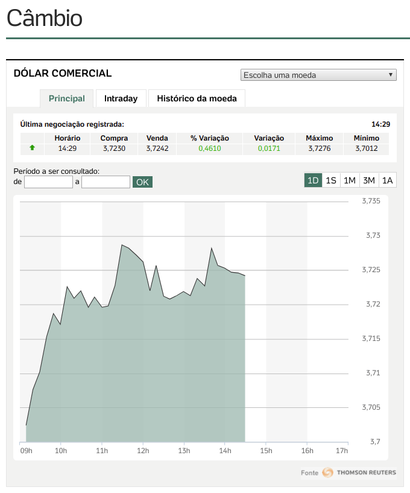

# Cotação UOL

Data taken from [UOL Economia - Cotações](https://economia.uol.com.br/cotacoes/cambio/dolar-comercial-estados-unidos/).

# Sample response

This is how the web site calls the endpoint:

    https://cotacoes.economia.uol.com.br/cambioJSONChart.html?callback=grafico.parseData&type=d&cod=BRL&mt=off

It returns an HTML excerpt like this:

    grafico.parseData([{"RangeY":{"value":0.003944999999999999}},[{"ask":3.7024,"ts":1533557340000},{"ask":3.7076,"ts":1533557940000},{"ask":3.7102,"ts":1533558540000}],{"high":"3.7276","pctChange":"0.475","open":"0","bid":"3.7235","ask":"3.7247","timestamp":1533575340000,"name":"Dólar Comercial","low":"3.7012","notFresh":false,"varBid":"0.0176"}]);

But if we remove the `callback` parameter, the result is pure JSON, ready to parse, like this (formatted for readability):

    [
      {
        "RangeY": {
          "value": 0.003944999999999999
        }
      },
      [
        {
          "ask": 3.7024,
          "ts": 1533557340000
        },
        {
          "ask": 3.7076,
          "ts": 1533557940000
        },
        {
          "ask": 3.7102,
          "ts": 1533558540000
        }
      ],
      {
        "high": "3.7276",
        "pctChange": "0.472",
        "open": "0",
        "bid": "3.7234",
        "ask": "3.7246",
        "timestamp": 1533575940000,
        "name": "Dólar Comercial",
        "low": "3.7012",
        "notFresh": false,
        "varBid": "0.0175"
      }
    ]
